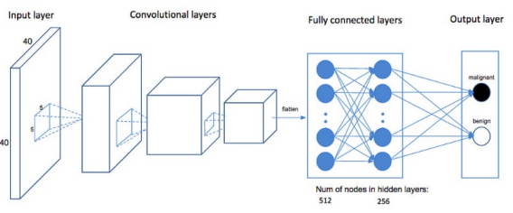
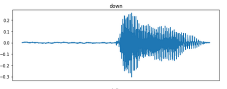
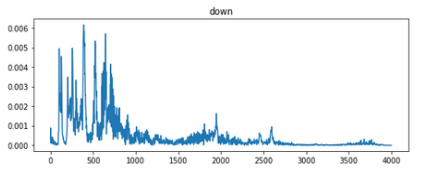
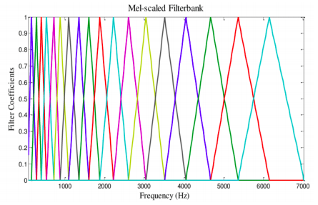
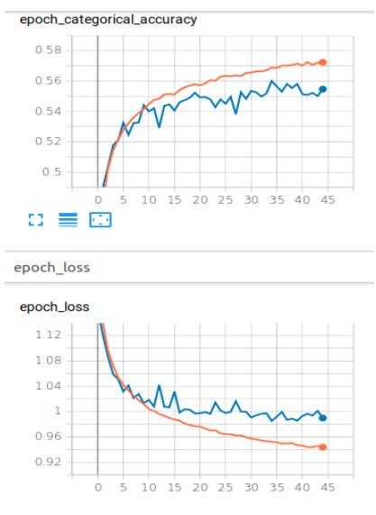
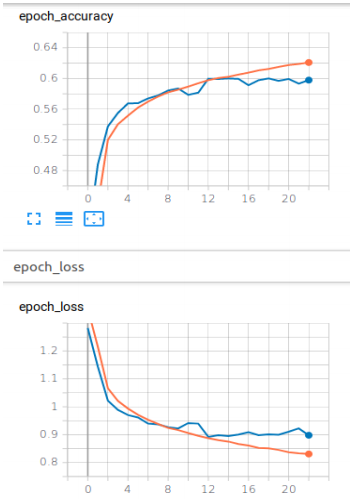
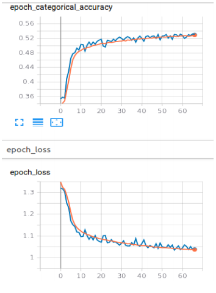
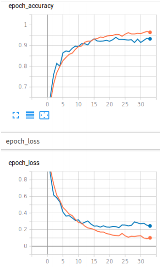

# Speech-Command-Recognition   

In the past few years there has been a boost in research of machine learning algorithms in the field of audio processing. This has been possible now because of the abundance of audio data available for analysis, specially speech data. This project explores various deep learning algorithms that can be applied to speech processing. In-depth analysis of the feature extraction techniques like Mel-frequency cepstrum coefficients (MFCC), and deep learning algorithms like Convolution Neural Network (CNN), Long short-term memory (LSTM) and hybrid models like CNN + LSTM have been presented. The evaluation of these models have also been provided in the report.  

## Architecture of CNN   

   

## Data preprocessing   

1. The audio signal is converted from a time domain to a frequency domain using FFT.  
   Audio signal in time domain,   
     
   Audio signal in frequency domain,  
     
2. To capture even the small variations, the signal is further coverted to a log-scale,using the formula,
   M(f) = 1125\*Ln(1+ f/700)  
3. This signal is then pass through a Mel-Scale Filterbank,  
     
4. Discrete Cosine Transform technique is used on the audio data from 26 filters to remove correlated data.  
5. Finally audio data from 13 out of 26 filters are kept the rest are discarded as they do not contain any useful data.  

After extracting features the MFCC features were normalized using the min-max technique and one-hot encoding was used
for unrelated categorical data.  

## Results   

### Models trained with MFCC features,   

- CNN  
    
- LSTM  
    
- Hybrid (CNN + LSTM)  
    

### Model trained with raw input data   

- CNN  
    

## Conclusion   

In this project 4 deep neural network models, 2 CNN, 1 LSTM and 1 Hybrid(CNN+LSTM), were trained on
speech command dataset, which can classify an audio file based upon the speech command spoken in audio file. From the results provided it can be following can be concluded: -   

- Even after tuning the hyperparameters the models overfit the dataset.
- Out of all the models CNN+LSTM took the longest time to converge (about 66 epochs) and even then the accuracy of the model was good.
- CNN model trained with raw audio data performed the best out of all the models, with almost 93% accuracy.
- If a model needs to be trained on only few speech commands then raw audio data can be used.
- For models to be trained on speech recognition then probably MFCC and other audio processing techniques should be used so as to decrease training time of the model (raw audio data had more than 1 million trainable parameters for just
  4 words and the training time was more than the models trained with MFCC features).   
